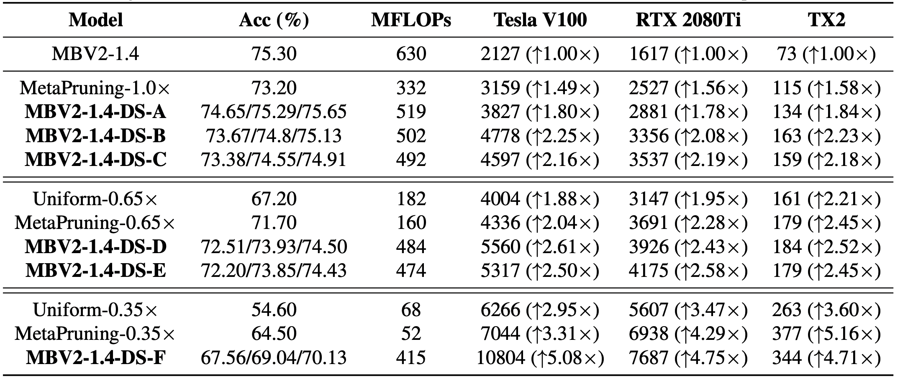

# DepthShrinker

## DepthShrinker: Experimental Results
- DepthShrinker delivers compact DNNs that outperform both SOTA channel-/layer-wise pruning techniques, e.g., a 3.06% higher accuracy and 1.53×
throughput on a Tesla V100 GPU over SOTA channel-wise pruning method MetaPruning.

<p align="center">
  
</p>

## Code Usage

Configurations for training/evaluation are set in `config/{config-file}.yaml` and some arguments can also be overrided via `argparse` in the `main.py`. For example, `DS.SEARCH` in the config file serves as a flag to switch between the two stages of identifying redundant activation functions and finetuning the network after the removel.


### Train with DepthShrinker from Scratch

- *Stage 1*: To search for redundant activaton functions, set `DS.SEARCH=True` and the target remaining ratio of activation functions via `DS.L0_SPARSITY` in the config file `configs/{config-file}.yaml` (optionally start from a pretrained model via setting `DS.PRETRAINED`). Next start the search process: 
```
python main.py --cfg configs/{config-file}.yaml --data_path {path-to-imagenet} --batch-size 256
```

- *Stage 2*: To finetune the resulting network in the stage 1, set `DS.SEARCH=False`, `DS.ACT_FROM_SEARCH=True`, and config `DS.SEARCH_CKPT` as the path to the checkpoint from the stage 1 (optionally enable self-distillation via setting `DS.DISTILL`), then run the above training command again.

**Supplementary Notes:**
- If training DepthShrinker:
  - Platform-aware search is already replaced with MPC-aware search by modifying `LAT_BEFORE` and `LAT_AFTER` in the `.yaml` files.
- If training SNL baseline:
  - Set `--cfg mbv2-140-SNL.yaml` in the command above.
  - Modify `line 839 in efficientnet_ds.py` as `share_act = False` to ensure ReLUs in the same block are not shared. Otherwise, if training DepthShrinker, set `share_act = True`.
  - In  `mbv2-140-SNL.yaml`, set `CHL_WISE` and `PIXEL_WISE` to control the granularity of SNL.
  - The procedure is the same with DepthShrinker.

### Training Commands
**1 DepthShrinker with MPC regularization**

`DepthShrinker/models/efficientnet_ds.py line #840`:
```
share_act = True
```
* Step 1: Search
  ```
  python main.py --cfg configs/mbv2-140.yaml --data_path /opt/dataset/imagenet --batch-size 256
  ```
  mbv2-140.yaml:
  ```yaml
  DISTILL: False
  SEARCH: True
  L0_SPARSITY: 0.4/0.6/0.8
  ```
* Step 2: Finetune
  ```
  python main.py --cfg configs/mbv2-140.yaml --data_path /opt/dataset/imagenet --batch-size 256
  ```
  mbv2-140.yaml:
  ```yaml
  DISTILL: False -> True
  SEARCH_CKPT: "path/to/checkpoint"
  SEARCH: False
  L0_SPARSITY: 0.4/0.6/0.8
  ```

**2 Baseline SNL**

`DepthShrinker/models/efficientnet_ds.py line #840`:
```
share_act = False
```
* Step 1: Search
  ```
  python main.py --cfg configs/mbv2-140-SNL.yaml --data_path /opt/dataset/imagenet --batch-size 256
  ```
  mbv2-140-SNL.yaml:
  ```yaml
  DISTILL: False
  SEARCH: True
  L0_SPARSITY: 0.4/0.6/0.8
  CHL_WISE: True/False
  PIXEL_WISE: False/True
  ```
  set `DepthShrinker/models/utils_ds.py line #14` the same with `CHL_WISE` above.
* Step 2: Finetune
  ```
  python main.py --cfg configs/mbv2-140-SNL.yaml --data_path /opt/dataset/imagenet --batch-size 256
  ```
  mbv2-140-SNL.yaml:
  ```yaml
  DISTILL: True
  SEARCH_CKPT: "/path/to/checkpoint"
  SEARCH: False
  L0_SPARSITY: 0.4/0.6/0.8

  CHL_WISE: True/False
  PIXEL_WISE: False/True
  ``` 
  set `DepthShrinker/models/utils_ds.py line #14` the same with `CHL_WISE` above.